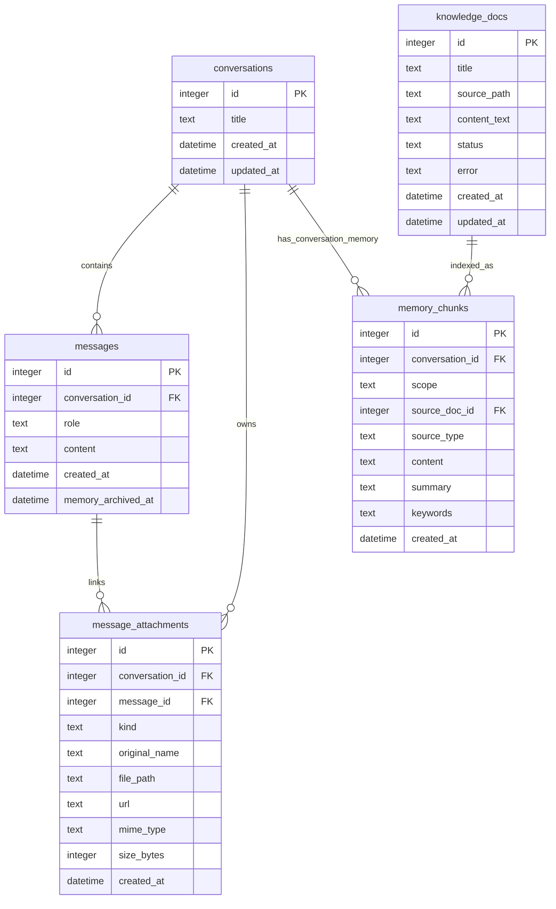
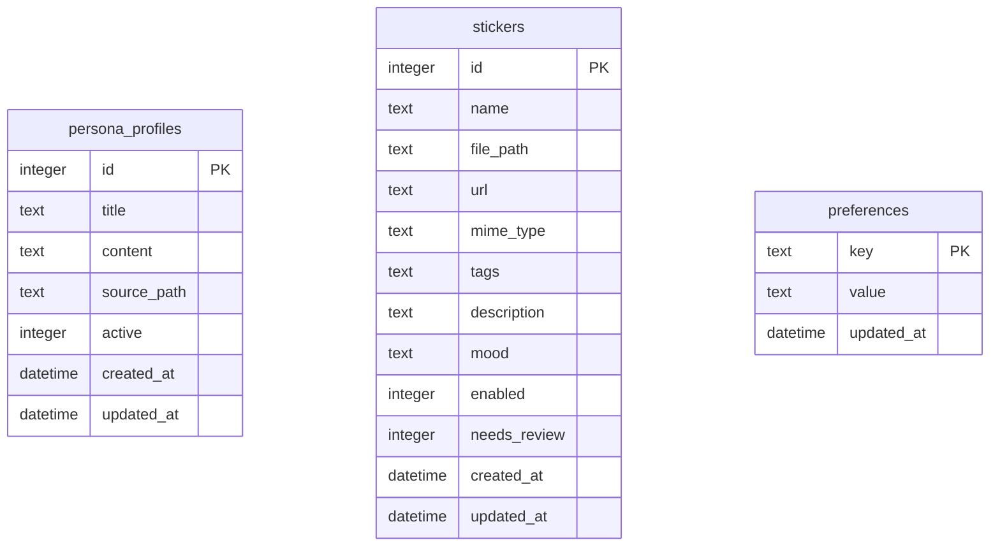

# 数据 E-R 模型

## 1. 实体关系总览



独立实体：



## 2. 表说明

### 2.1 conversations

会话聚合根。每个聊天线程对应一条记录。

| 字段 | 说明 |
| --- | --- |
| `id` | 会话 ID |
| `title` | 会话标题，默认“新对话” |
| `created_at` | 创建时间 |
| `updated_at` | 最近更新时间，用于会话列表排序 |

关键行为：

- `EnsureConversation` 在传入 ID 不存在时创建新会话。
- `MaybeTitleConversation` 会用首条用户消息生成短标题。
- 删除会话时，删除该会话消息、附件关联、会话内记忆和 JSONL。

### 2.2 messages

当前会话原始聊天消息。

| 字段 | 说明 |
| --- | --- |
| `id` | 消息 ID |
| `conversation_id` | 所属会话 |
| `role` | `user` 或 `assistant` |
| `content` | 消息文本 |
| `created_at` | 创建时间 |
| `memory_archived_at` | 被压缩归档为长期记忆的时间；不代表消息被删除 |

关键行为：

- `GetHistory(conversationID, limit)` 只读取当前会话消息。
- `SearchMessages` 支持 `search_memory` 查询当前会话原始消息。
- 压缩消息时只标记 `memory_archived_at`，保留完整历史。

### 2.3 memory_chunks

长期记忆和文档索引统一表。

| 字段 | 说明 |
| --- | --- |
| `id` | 记忆 ID，也是工具中的 `memory_id` |
| `conversation_id` | 会话 ID；全局记忆通常写入 1，但读取以 `scope=global` 为准 |
| `scope` | `global` 或 `conversation` |
| `source_doc_id` | 文档索引来源文档 ID，可为空 |
| `source_type` | `conversation`、`manual`、`knowledge_doc` 等 |
| `content` | 原始或索引内容 |
| `summary` | 摘要 |
| `keywords` | 关键词 |
| `created_at` | 创建时间 |

可见性规则：

- `scope=global` 对所有会话可见。
- `scope=conversation` 只对相同 `conversation_id` 可见。
- `GetChunk(id)` 只按 ID 取数据；调用方必须再做 scope/conversation 校验。

### 2.4 knowledge_docs

用户上传历史文档。

| 字段 | 说明 |
| --- | --- |
| `id` | 文档 ID |
| `title` | 文档标题 |
| `source_path` | 上传文件路径 |
| `content_text` | 提取出的正文，最多保存 `maxDocTextRunes` |
| `status` | `processing`、`ready`、`failed` 等 |
| `error` | 解析或索引错误 |
| `created_at` | 创建时间 |
| `updated_at` | 更新时间 |

关系：

- 一个文档可切分成多个 `memory_chunks`，这些 chunk 的 `source_type=knowledge_doc`，`source_doc_id=knowledge_docs.id`。
- 文档正文通过 `read_uploaded_doc` 或 JSON Context 文档路由按需读取。

### 2.5 message_attachments

聊天图片附件。

| 字段 | 说明 |
| --- | --- |
| `id` | 附件 ID |
| `conversation_id` | 上传时所属会话 |
| `message_id` | 发送后关联的消息 ID；发送前可为空 |
| `kind` | 当前默认为 `image` |
| `original_name` | 原始文件名 |
| `file_path` | 本地文件路径 |
| `url` | 静态访问 URL |
| `mime_type` | MIME 类型 |
| `size_bytes` | 文件大小 |
| `created_at` | 上传时间 |

关键规则：

- 发送聊天前，后端检查附件 `conversation_id` 必须等于当前会话。
- `LinkAttachments` 只会关联当前会话内的附件。

### 2.6 persona_profiles

人设配置。

| 字段 | 说明 |
| --- | --- |
| `id` | 人设 ID |
| `title` | 标题 |
| `content` | 人设正文 |
| `source_path` | 上传来源路径 |
| `active` | 是否启用 |
| `created_at` | 创建时间 |
| `updated_at` | 更新时间 |

关键规则：

- 同一时间最多一个 active。
- 创建重复标题的人设时会复用/更新已有记录。

### 2.7 stickers

表情包库。

| 字段 | 说明 |
| --- | --- |
| `id` | 表情包 ID |
| `name` | 名称 |
| `file_path` | 本地路径 |
| `url` | 静态 URL |
| `mime_type` | MIME 类型 |
| `tags` | 检索标签 |
| `description` | 描述 |
| `mood` | 情绪分类 |
| `enabled` | 是否启用 |
| `needs_review` | 是否需要人工复核 |
| `created_at` | 创建时间 |
| `updated_at` | 更新时间 |

删除表情包当前实现为软删除：`enabled=0`。

### 2.8 preferences

键值型配置。

| 字段 | 说明 |
| --- | --- |
| `key` | 配置键 |
| `value` | 配置值 |
| `updated_at` | 更新时间 |

常见键：

- `system_prompt`
- `assistant_name`
- `user_name`
- `relationship`
- `tone`
- `emotion_handling`
- `likes`
- `dislikes`
- `boundaries`
- `memory_policy`
- `context_note.{conversation_id}`

## 3. 数据生命周期

### 3.1 聊天消息

1. 用户发送消息。
2. 后端校验并保存 `messages(role=user)`。
3. 关联图片附件。
4. 模型返回后保存 `messages(role=assistant)`。
5. 同步 `data/conversations/{conversation_id}.jsonl`。
6. 当上下文过长时，异步压缩部分未归档消息为 `memory_chunks`，并标记 `memory_archived_at`。

### 3.2 上传文档

1. 用户上传文件。
2. 后端提取文本并创建 `knowledge_docs(status=processing)`。
3. 文本按块切分。
4. 每个块生成摘要和关键词，写入 `memory_chunks(scope=global, source_type=knowledge_doc)`。
5. 文档状态更新为 `ready`；失败则更新为 `failed` 和错误信息。

### 3.3 表情包

1. 用户上传图片。
2. 后端保存文件。
3. 若重复，返回已有启用表情包。
4. 若有 API Key，调用视觉模型识别元数据；否则用文件名兜底。
5. 写入 `stickers`。
6. 用户删除时置 `enabled=0`。

## 4. 约束和索引建议

当前建表语句主要定义主键和外键，尚未显式创建业务索引。随着数据增长，建议补充：

```sql
CREATE INDEX IF NOT EXISTS idx_messages_conversation_id_id
ON messages(conversation_id, id);

CREATE INDEX IF NOT EXISTS idx_memory_chunks_scope_conversation_id
ON memory_chunks(scope, conversation_id, id);

CREATE INDEX IF NOT EXISTS idx_memory_chunks_source_doc
ON memory_chunks(source_type, source_doc_id);

CREATE INDEX IF NOT EXISTS idx_message_attachments_conversation_message
ON message_attachments(conversation_id, message_id);
```

这些索引不是当前代码必需条件，但能改善历史消息、记忆列表、文档索引和附件加载的查询性能。

## 2026-09-17 记忆版本、FTS 与请求统计

memory_chunks 保留所有旧列和 assistant 隔离，新增 status(active/superseded/revoked)、source_conversation_id(可空，引用 conversations，删除会话时 SET NULL)、memory_type(fact/preference/diary/emotion/summary)、confidence(0..1)、updated_at。superseded_by 复用已有字段。active 与 status 通过触发器兼容双向同步；旧失效记录根据 superseded_by 标记失效原因，迁移不删除记忆或消息。

memory_chunks_fts 是 external-content FTS5 表，索引 content/summary/keywords/topic_label，使用 trigram；首次迁移 rebuild，增删改触发器持续维护。构建必须带 -tags sqlite_fts5。

request_stats: id、requested_at、conversation_id(后台独立调用可空)、flow_id、record_kind(model/chat)、input_tokens、output_tokens、cache_hit_tokens(未知为 NULL)、usage_reported、cache_complete、retrieval_ms、total_latency_ms、model、request_count、failed。model 行逐次记录实际 HTTP 调用，chat 行按 flow_id 汇总首次调用及工具后续调用；只汇总 chat 行可避免重复计数。请求和聊天内容、密钥不入统计表。未报告 usage 时 token 列为 0 且 usage_reported=false，不能解释为真实零消耗。
